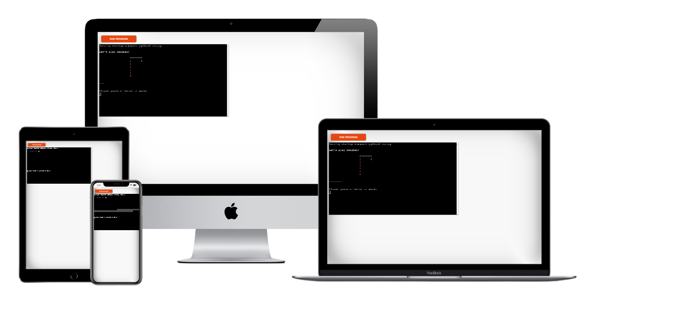
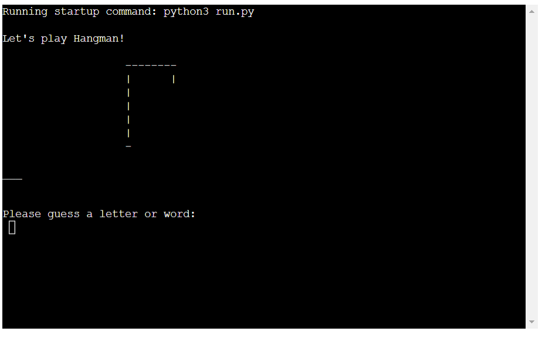
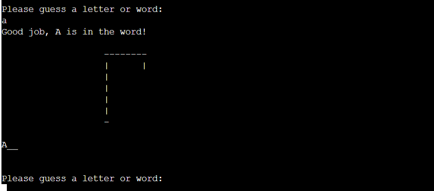
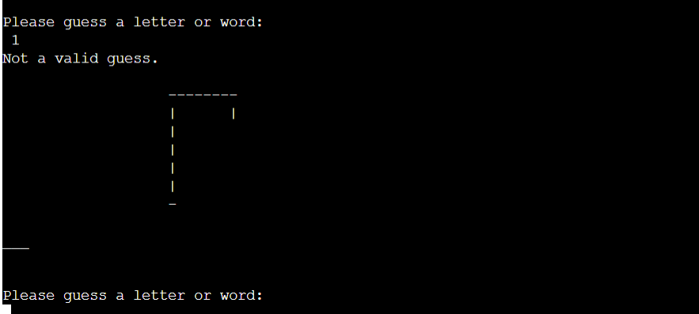
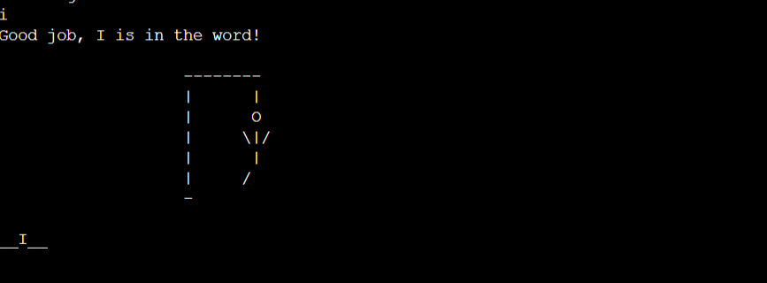
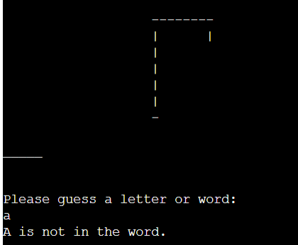
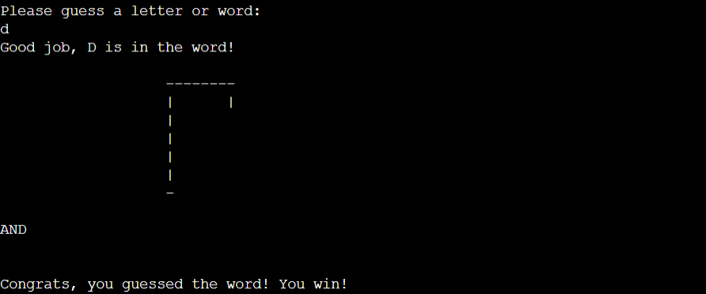
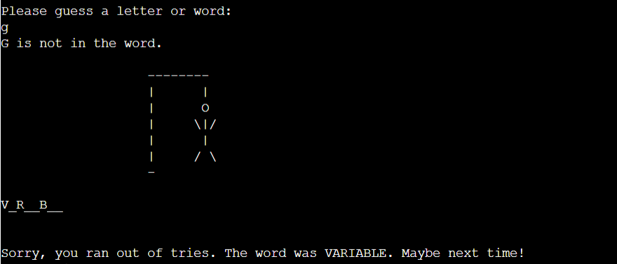
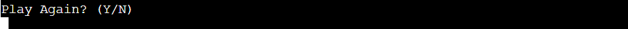
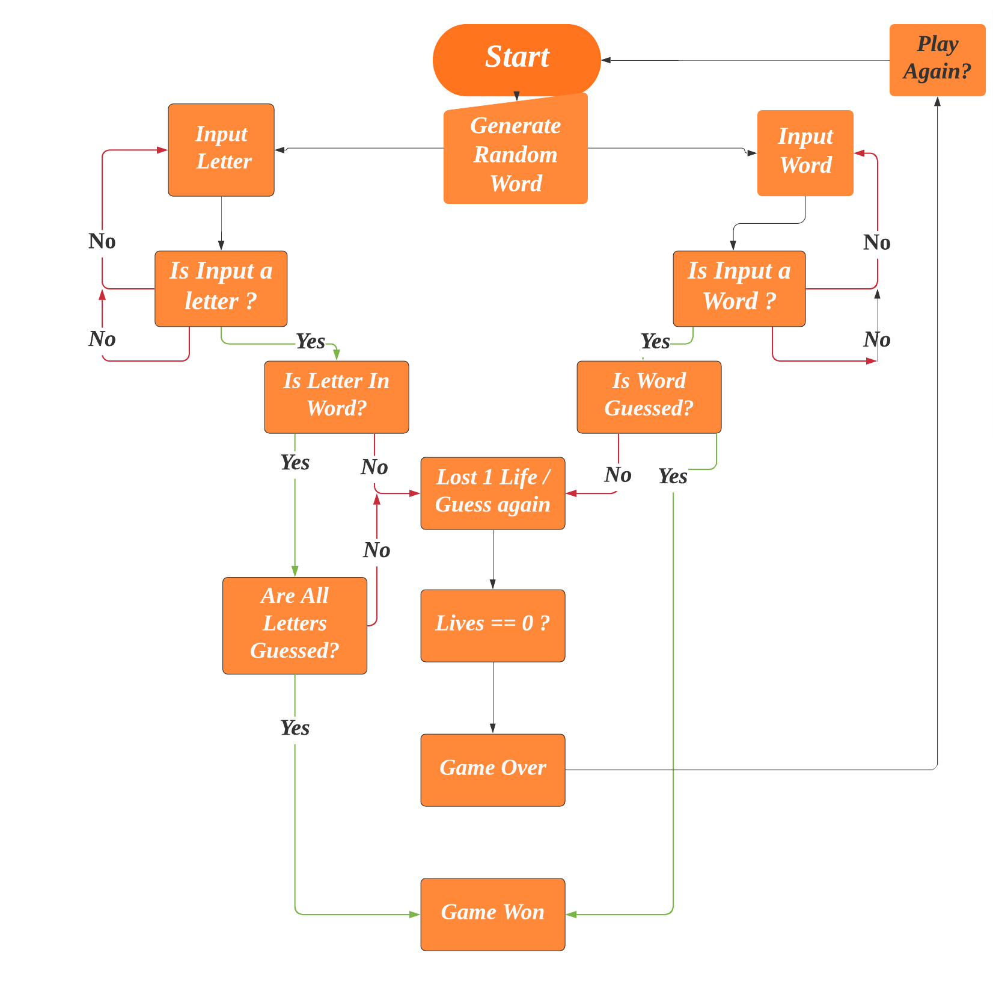

# HANGMAN
A Hangman Game On Python is about guessing letters (A-Z) to form the words. If the player guesses the right letter that is within the word, the letter appears at its correct position. The user has to guess the correct word until a man is hung, then the game is over.

The Hangman Game In Python is written in a python programming language, In this Hangman Game Project is to implement the Hangman Game Using Python. Python loops and functions are enough to build this game here

[Here is the live version of my project.](https://hangman-python-keywords.herokuapp.com/)

## How to play
Hangman is a paper and pencil guessing game for two or more players. One player thinks of a word, phrase or sentence and the other(s) tries to guess it by suggesting letters within a certain number of guesses.

In this game the computer selects a random word from the Python keywords (glossary) that gets 
displayed as "_______" and with visualization of a hangman in different stages.
If user guesses a letter thats in the word it displays in the terminal on the line in it´s right position in the word.
When the user guesses the whole word they win and can choose to play again or exit the game.
The user has 7 lives to guess letters and/or word to win the game otherwise they will lose.

# Features
## Existing features
  * Welcome screen (that shows the hanger and text saying "Let's play Hangman")
  * Choice input to enter a letter or a word.
  * Play aginst the computer.
  * accept user inputs

  * accept user inputs.
  * Valid Guess.

  * accept user inputs.
  * Invalid Guess.
  

  * accept user inputs.
  * Correct Guess.
  

  * accept user inputs.
  * Wrong Guess.
   

  * accept user inputs.
  * Win Game.
  

  * accept user inputs.
  * Lose Game.
  

  * Play Game again Input.
  * accept user inputs of Y for Yes and N for No to exit.
  

# Flowchart

## Future features
  * Different levels of difficulty.
  * Multiplayers

# Testing
I have manually tested this project by doing the following:
  * Passed the code through a PEP8 linter and confirmed there are no problems.
  * Tested in my local terminal and the Code Institute Heroku terminal.

# Bugs
  * Small error messages in terminal of long lines and trailing whitespace, but does not affect ruuning the program.
  * No other bugs reported.

# Validator testing
  * PEP8 
    * No errors were returned from [PEP8online](http://pep8online.com/)

# Deployment
  * Steps for deployment
    * Fork or clone this repository
    * Create a new Heroku app
    * Set the buildbacks to Pyhton and NodeJS in that order
    * Link the Heroku app to repository
    * Click on Deploy

# Credits
  * Code Institute for the deployment terminal
  * Online websites like w3schools.com
  * Youtube videos